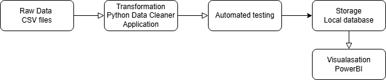

# Project Objective
- Document project
- Design a pipeline
- Clean sample data using a Python application
- Visualise the data & pipeline outcomes

1. Set up GitHub Repo for project.
2. Design an architectural diagram for the data cleaning pipeline.
3. Implement the python application that does the data cleaning.
4. Test the puthon application.
5. If there are no bugs, deploy the pipeline (CI/CD).
6. Trigger the pipeline to write to a database.
7. Use the written data to create a PowerBI dashboard.

# Architecture Diagramm

Python:
- Check for NA values and deal with them.
- Turn the dates into datetime. 
- Data enrichment: calculate the number of days a book was on loan.