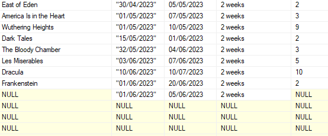
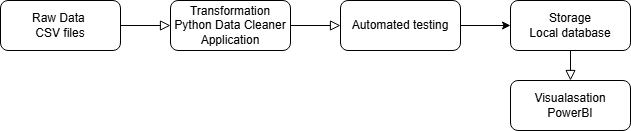
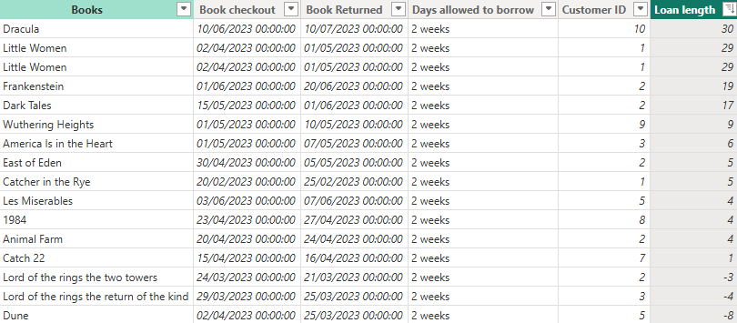

# Data Cleansing Project

## Overview:

This project focused on developing a data cleaning pipeline, from its initial setup to deployment and visualization. The goal was to automate the data cleaning process, trigger the pipeline through CI/CD, and connect the cleaned data to PowerBI to show the process statistic and to allow data analysts to use it in the future for creating meaningful insights. The project followed a systematic approach, ensuring code versioning, testing, deployment, and visualization, to meet business intelligence needs effectively.

##What Was Done:

1. Set up GitHub Repository for Project:
Created a GitHub repository to manage the project code, track changes, and facilitate collaboration using version control.

2. Designed an Architectural Diagram for the Data Cleaning Pipeline:
Visualized the flow of the data cleaning pipeline, highlighting key components such as input data, cleaning operations, triggers, and outputs.

3. Implemented Python Application for Data Cleaning:
Developed a Python application that processes and cleans raw data, handling missing values, duplicates, and enrich the data.

4. Tested the Python Application:
Conducted thorough testing to ensure the data cleaning application works as expected, identifying and resolving any bugs or performance issues.

5. Triggered the Pipeline to Write to a Database:
Configured the pipeline to automatically insert the cleaned data into a database, enabling further analysis and storage.

6. Created a Container in Docker:
Containerized the Python application using Docker to ensure portability and ease of deployment across different environments.

7. Connected a newly created databse to Power BI Dashboard:
Imported the cleaned data into Power BI to to show the process statistic and to allow data analysts to use it in teh future for creating meaningful insights.

##Learnings:

1. Arranging Code in the Correct Order:

One of the challenges faced was ensuring that the code was arranged in the correct order. A wrong order could lead to unwanted results or errors, especially in a complex pipeline. Paying close attention to the logical flow of the code was crucial.

2. Connecting to a Database through VS Code:

Establishing the correct database connection via Visual Studio Code (VS Code) posed a challenge. Ensuring the right connection credentials were in place was important to establish a smooth connection and successfully interact with the database.

3. Troubleshooting When Moving Code from Notebook to Python File:

Even though the code was thoroughly tested in Jupyter notebooks, moving it to a Python file brought up unexpected issues. This required additional debugging and troubleshooting to make sure the code worked seamlessly in its new format.

These complications required extra time to solve, which contributed to the overall hours spent on the project. It's important to consider such challenges for future projects as key learnings, as they can help with better planning, more accurate time estimations, and smoother execution in future work.

##Benefits of the Project:

1. Importance of Using Cleaned Data:

The project ensured that only high-quality, clean data was used for analysis, which is critical for making accurate business decisions. Cleaned data eliminates inconsistencies, duplicates, and errors, providing more reliable insights and improving overall data integrity.

2. Reusability of the Code:

The code developed for this project is modular and can be easily adapted with little adjustments to clean other datasets in the future. This flexibility reduces time and effort when handling new data, making it a scalable solution for ongoing data processing tasks.

##Conclusion:

The project successfully implemented an automated data cleaning pipeline, ensuring high-quality. By integrating Python for data processing, Docker for containerization, and Power BI for visualization, we created a robust solution that streamlined data handling and enhanced data-driven decision-making.
